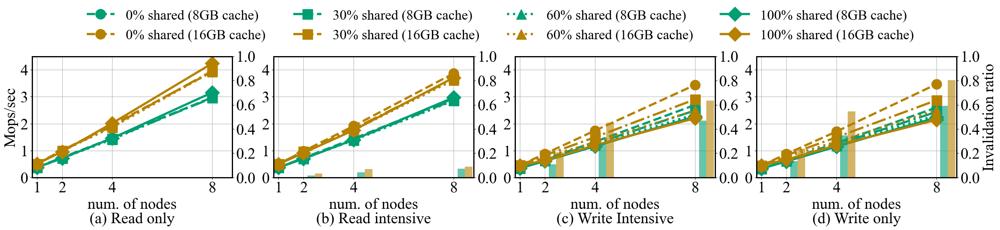
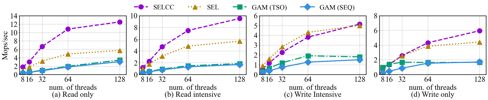
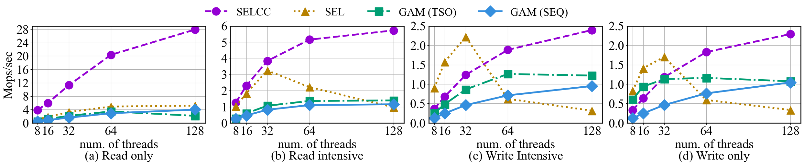
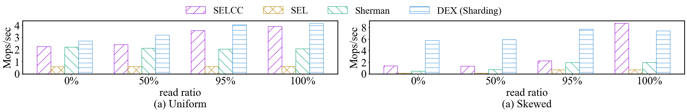
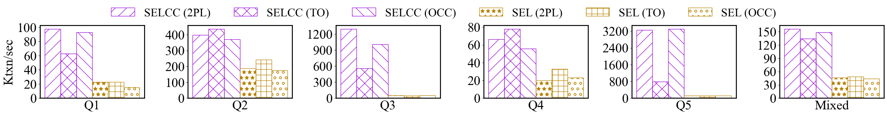
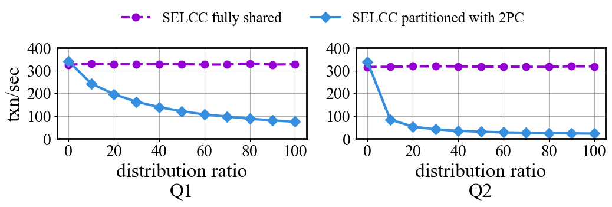

# SELCC: Coherent Caching over Compute-Limited Disaggregated Memory
This repo is the implementation of SELCC; a Shared-Exclusive Latch Cache Coherence protocol that maintains cache coherence without imposing any computational burden on the remote memory side. SELCC builds on a one-sided shared-exclusive latch protocol by introducing lazy latch release and invalidation messages among the compute nodes so that it can guarantee both data access atomicity and cache coherence. SELCC minimizes communication round-trips by embedding the current cache copy holder IDs into RDMA latch words and prioritizes local concurrency control over global concurrency control. We instantiate the SELCC protocol onto compute-sided cache, forming an abstraction layer over disaggregated memory. This abstraction layer provides main-memory-like APIs to upper-level applications,  and thus enabling existing data structures and algorithms to function over disaggregated memory with minimal code change. To demonstrate the usability of SELCC, we implement a B-tree and three transaction concurrency control algorithms over SELCC's APIs. Micro-benchmark results show that the SELCC protocol achieves better performance compared to RPC-based cache-coherence protocols. Additionally, YCSB and TPC-C benchmarks indicate that applications over SELCC can achieve comparable or superior performance against competitors over disaggregated memory.
## Usage:
* Establish the RDMA connection by calling **RDMA_Manager::Get_Instance(config_t* config)**
* Create Disaggregated memory abstraction object via class DDSM.
* Allocate global cache line by **DDSM::Allocate_Remote**
* Conduct read and write under the **protection of DDSM::SELCC_Shared_Lock** and **DDSM::SELCC_Exclusive_Lock**

### Build for POSIX
This project supports CMake out of the box.
```bash
mkdir -p build && cd build
cmake -DCMAKE_BUILD_TYPE=Release .. && make all -j
```

### How to run
First, you should config the connection.conf under the main directory. The first line of that file represents the compute nodes' IP addresses, and the second line represents the memory nodes' IP addresses.
* Memory node side: 
```bash
./memory_server PortNum RemoteMemorySize NodeID
```
* Compute node side:
* To utilize SELCC in your code, you need refer to public interface in **include/DSMEngine/\*.h** .
* compile your code with static library libDSMEngine.a
```bash
YourCodeOverSELCC
```
* Run the micro benchmarks
```bash
cd scripts
./bench_micro.sh
```
* Run the btree benchmarks
```bash
cd scripts
./btree_exp.sh
```
* Run the TPC-C benchmarks
```bash
cd scripts
./TPCC_exp.h
```

## Performance
Here is the performance report for micro benchmark for general global cache line access, YCSB benchmark for index over SELCC, TPC-C for transaction engine over SELCC.
### Setup
The experiments are conducted on a cluster of 16 nodes in Cloudlab~\cite{CloudLab19}. The chosen instance type is c6220, which features two Xeon E5-2650v2 processors (8 cores each, 2.6GHz) and 64GB (8GB × 8) of memory per node. The cluster is interconnected using 56 Gbps Mellanox ConnectX-3 FDR Network devices. Each server runs Ubuntu 18.04.1, and the NICs are driven by Mellanox OFED-4.9-0.1.7.
The 16 servers are divided into 8 compute servers and 8 memory servers. The compute servers can utilize all the CPU cores but have a limited local cache (8GB by default). Conversely, the memory agents on the memory servers have access to all the memory but are restricted to utilizing a limited number of CPU cores (1 core by default).
### Microbench
competitors: 
* GAM: [Efficient Distributed Memory Management with RDMA and Caching](https://www.vldb.org/pvldb/vol11/p1604-cai.pdf)
* SEL: an one-sided access framework that operates without compute-side caching.
Results:
Scalability:
<!--  -->

Workload with access locality:
<!--  -->

Workload with access skewness
<!--  -->


### Index over SELCC
competitors: 
* btree over SELCC: a demonstration of btree implemented by SELCC APIs
* btree over SEL: a demonstration of btree implemented by SEL APIs (without local cache)
* Sherman: [Sherman: A Write-Optimized Distributed B+Tree Index on Disaggregated Memory](https://dl.acm.org/doi/pdf/10.1145/3514221.3517824)
* DEX: [DEX: Scalable Range Indexing on Disaggregated Memory](https://arxiv.org/abs/2405.14502)

Results:
<!--  -->


### Tranasction engine over SELCC
competitors: 
* 2PL over SELCC: 2 phase locking concurrency control with no wait deadlock avoidance strategy over SELCC APIs
* TO over SELCC: timestamp ordering concurrency control over SELCC APIs
* OCC over SELCC: optimistic concurrency control over SELCC APIs
* 2PL over SEL: 2 phase locking concurrency control with no wait deadlock avoidance strategy over SELCC APIs
* TO over SEL: timestamp ordering concurrency control over SELCC APIs
* OCC over SEL: optimistic concurrency control over SELCC APIs

Results:
<!--  -->


<!--  -->


## Repository contents

Guide to folders:
* **/btr**: The files for btree over SELCC.
* **/include**: The folder for the header files exposed to the users.
* **/memory_node**: The implementation for memory servers.
* **/port**: The files defining macro for turning on and off optimizations.
* **/scripts**: The bash scripts for mulitple node setup.
* **/storage**: Implementations of DB tables, btree nodes, data pages, tuples and RDMA communication.
* **/util**: Some necessary tools for system building.

Guide to header files:

* **include/DDSM.h**: High-level interface for upper layer applications: Start here.

* **include/DSMEngine.h**: Low-level interfaces for potential developers.

